## Getting Started

### Downloading Raspberry Pi Desktop

Go to https://www.raspberrypi.com/software/raspberry-pi-desktop/ and download Raspberry Pi Desktop compatible with PC and Mac. This is what we will install on the server.

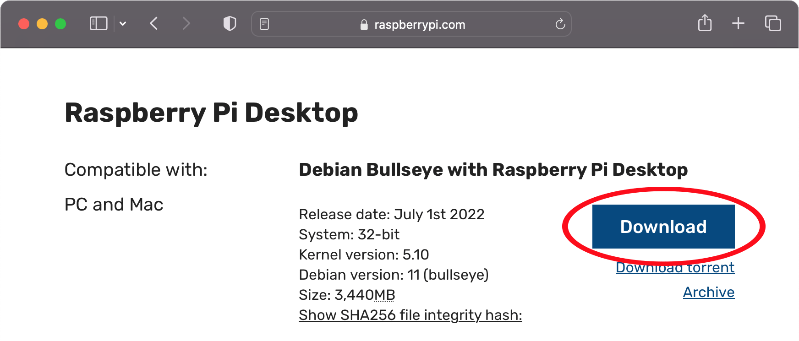

### Burning the ISO to a USB Stick

It is recommended to use Balena Etcher, available at https://etcher.balena.io/, to burn the image.
In Etcher, select "Flash from File" and the ISO downloaded previously.

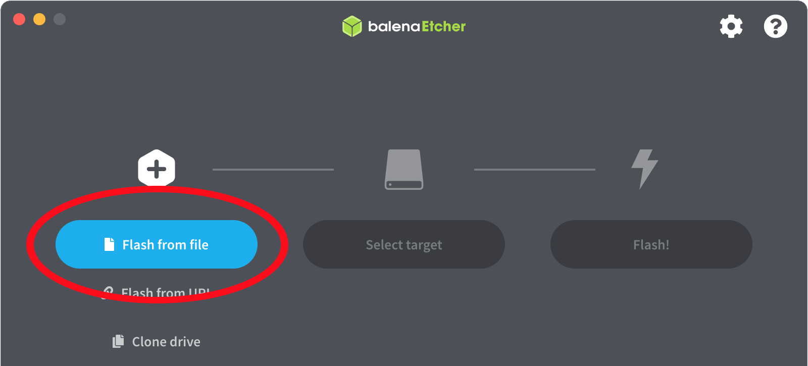

In this example the ISO is "2022-07-01-raspios-bullseye-i386.iso". Click "Select Target" and choose the USB stick.
Finally click "Flash!".

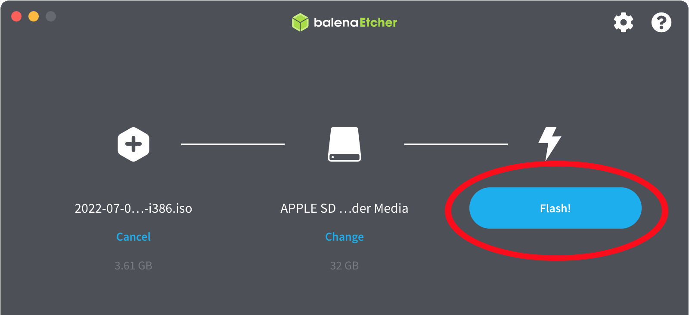

The Raspberry Pi desktop install image will be written to the USB stick.

### Boot from Pi Desktop USB Stick

On the computer which will be the server, starting with the server powered off, insert the USB stick. Boot the computer to BIOS and set it to boot from the USB stick.
Reboot and the installation should begin.

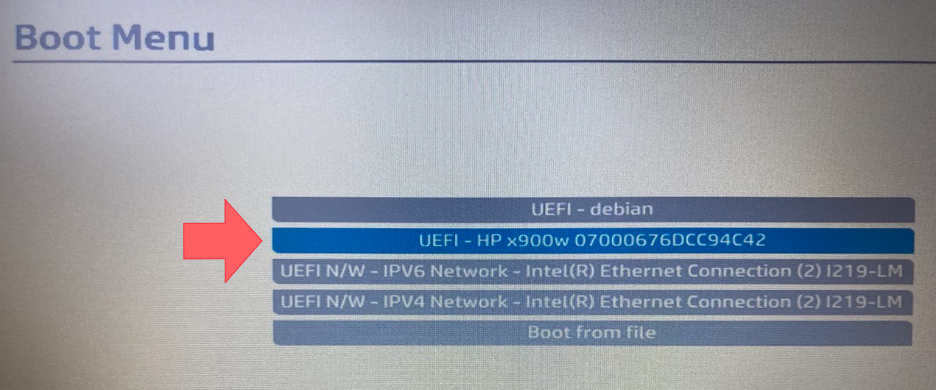

### Starting Pi Desktop Installation

In the GNU GRUB menu, select "Graphical install" using the arrow keys, and press Enter.

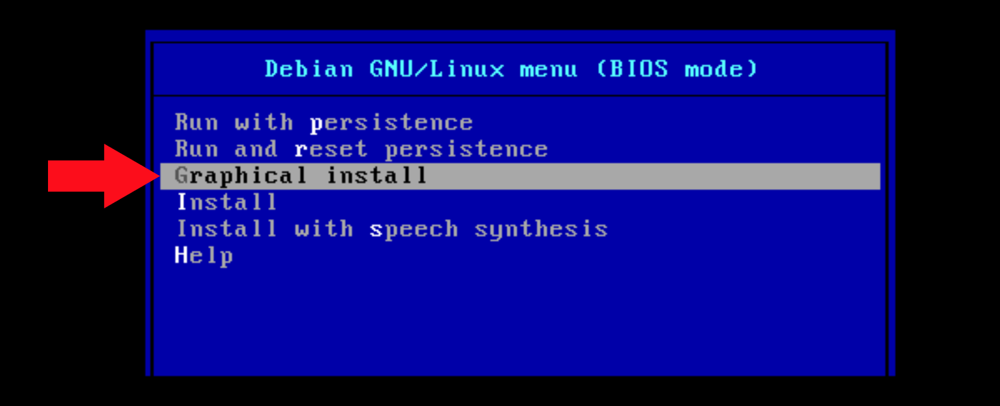

Select the relevant settings e.g. "American English" for the keyboard layout.

### Hard Drive Setup

The next step is to setup the hard drive partitions for Linux. For simplicity you can select "Guided - use entire disk". Linux power users may choose their own partition scheme.


Next choose "Separate /home partition" as this is where user files go, so later upgrades should carry less risk to user data.

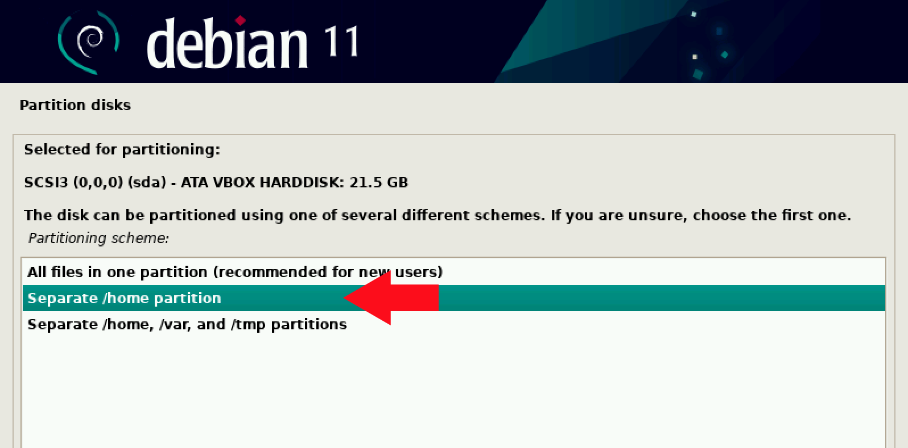

Select the disk to install to (not the USB stick).

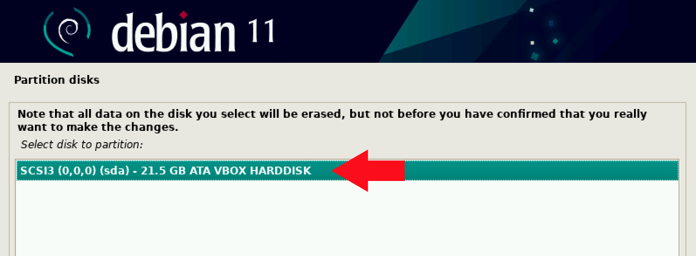

Next, select "Finish partitioning and write changes to disk" and press Enter. Choose "Yes" on the warning that your hard drive is about to be overwritten and click "Continue".

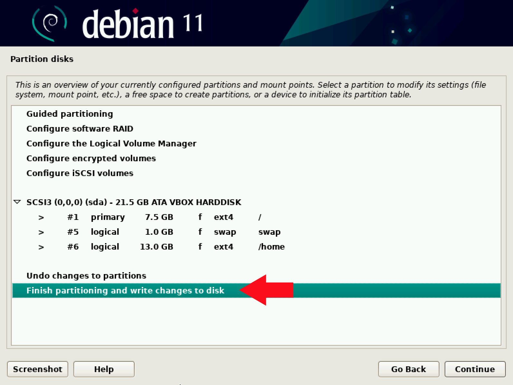

### Finish Debian Installation

The Debian installer starts copying files to your server hard drive. The installer will let you know when the installation is complete. Remove the USB stick and boot into the newly installed system.

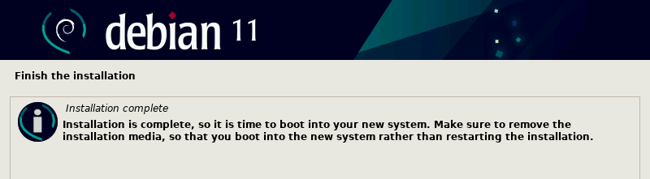

### Initial Pi Desktop Configuration

After booting, you will need to set the relevant settings for your location e.g. country, language, timezone, etc., as well as your username and password.

## Preparing a DHCP Server

Once the Raspberry Pi desktop has booted on the server computer, the next step is to configure DHCP. For this example, the configuration consists of a WAN router attached to a network switch. The WAN router is at `192.168.0.1`. The Pi Desktop OS server is set to have a static IP of `192.168.0.10`. PiServer includes a DHCP server for the clients.

Open a terminal window and then from the command prompt, type:
```
sudo nano /etc/dhcpcd.conf
```

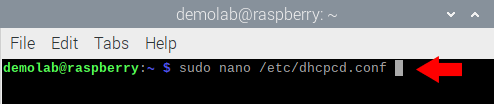

Find the lines that have the `# Example static IP configuration:` and then edit the configuration to match your network configuration. Here's an example of the WAN router and static IP.

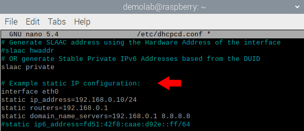

After saving the changes, it's probably easiest just to reboot the computer. After rebooting, you can open a command line and enter the command ip address.
You should see the configuration that you entered previously.

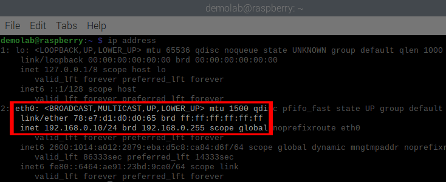

## Setup Raspberry Pi for Network Boot

Setup a Raspberry Pi 3/4 for network boot. You will need a Raspberry Pi connected to a keyboard, mouse, monitor, and your network. Connect the monitor to the port furthest from the power input on the Pi 4 as shown in the photo; if that doesn’t work, try the other
monitor port. The Raspberry Pi can be running any of the Raspberry Pi OS versions (Raspberry Pi OS lite is fine).

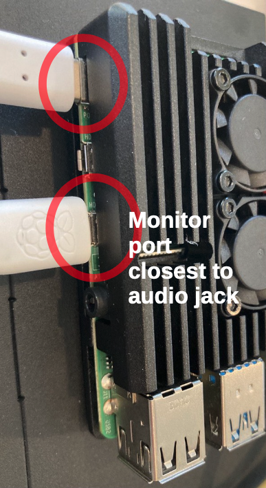

You can follow this guide to setup a Raspberry Pi and install the Raspberry Pi OS: 

https://www.raspberrypi.com/tutorials/how-to-set-up-raspberry-pi/

Depending on the version of Raspberry Pi you have (3 or 4), configure network boot using the steps in the manual here:

https://www.raspberrypi.com/documentation/computers/remote-access.html#client-configuration

## Start the PiServer Configuration

Now it's time to start the PiServer configuration tool and configure the server.
From the Pi Desktop, click the Raspberry to open the menus, go to "Preferences", then "Pi Server".

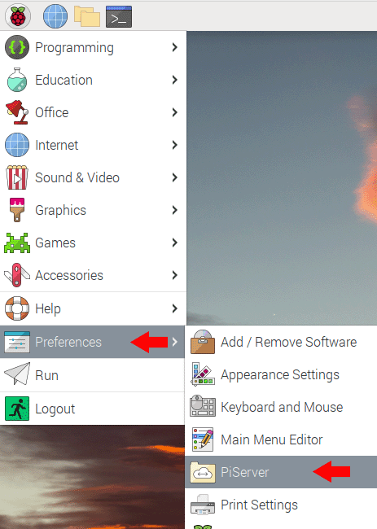

The introduction screen mentions under “Requirements” that you have to use a Raspberry Pi 3 or 4, and it has to be configured for network boot. We did this in [Setup Raspberry Pi for Network Boot](#setup-raspberry-pi-for-network-boot).

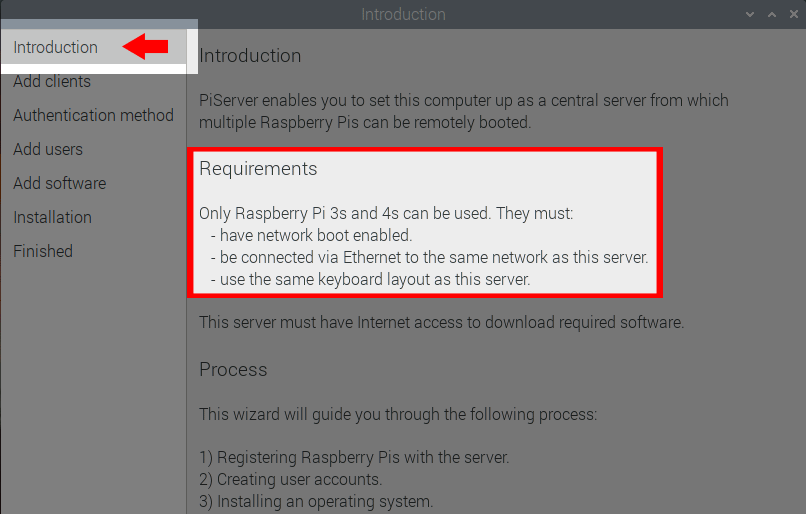

### Adding a Client to PiServer

Move to the "Add clients" window in the PiServer configuration tool by clicking "Next". Power on the Raspberry Pi with your network-boot configured Raspberry Pi from [Setup Raspberry Pi for Network Boot](#setup-raspberry-pi-for-network-boot). You should see the Raspberry Pi attempting to boot from the network after a short time as shown here.

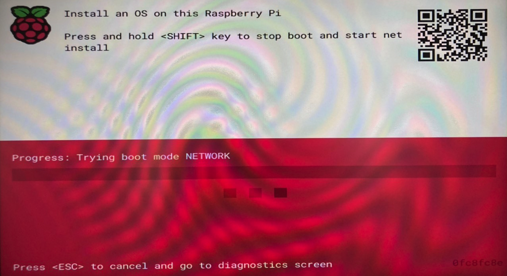

Meanwhile, on the PiServer configuration tool you should see that a new entry has appeared, this would be the MAC address of the Raspberry Pi you just connected. For this tutorial we will setup just one client, but you could easily set up more than one here. Click "Next".

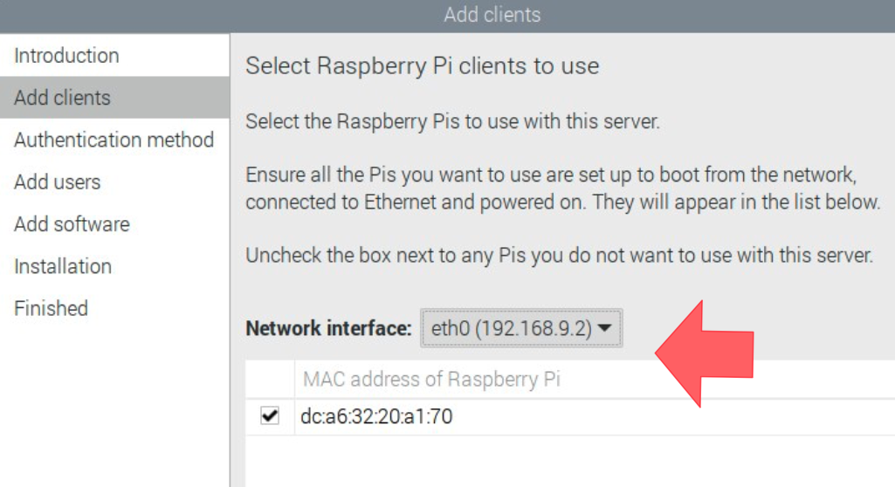

### Selecting User Authentication

On the next PiServer configuration screen, we choose the authentication method. For our demonstration we are going to authenticate users against PiServer. Active Directory is an available option. Click "Next".

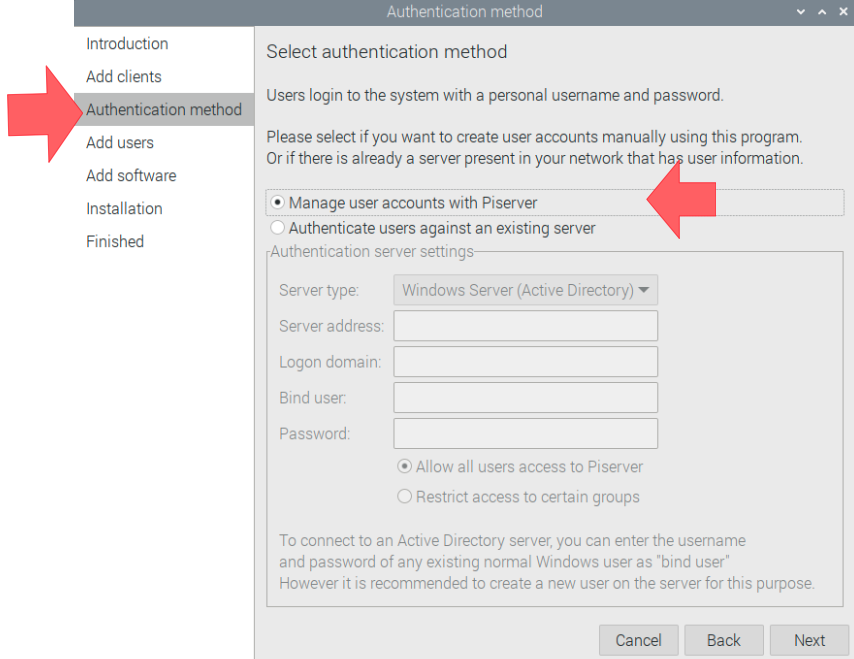

### Adding User Accounts

For demonstration, we created a user "larry" with password "raspberry", another user "moe" with the password "blueberry", and a third user "curly" with password "blackberry". Click "Next" again.

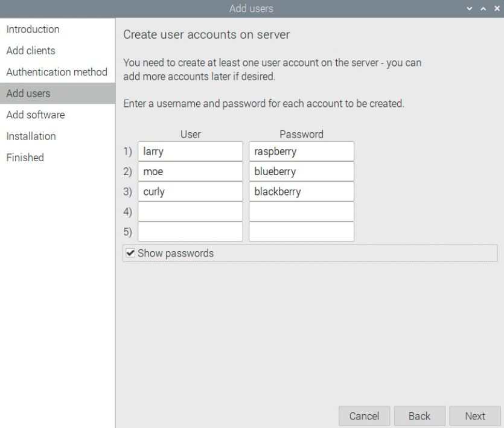

### Choose Operating System

Let’s select the base operating systems that will be delivered to the Pi clients. The Lite versions are command line only, but both the Raspberry Pi OS and the Raspberry Pi OS (full) are graphical desktops. You can also create your own images, or modify the OS images that are provided. A little more on that later. For now, choose “Raspberry Pi (OS 64 bit)” and click "Next".

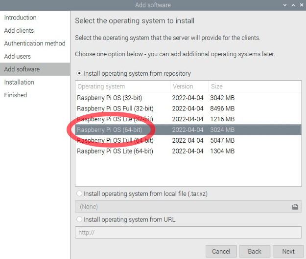

### Finish Initial Configuration

The PiServer configuration tool will download the OS images. Click "Next" when it’s done.

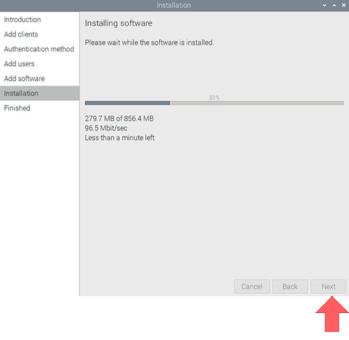

Basic configuration of PiServer is now complete. Click "Close".

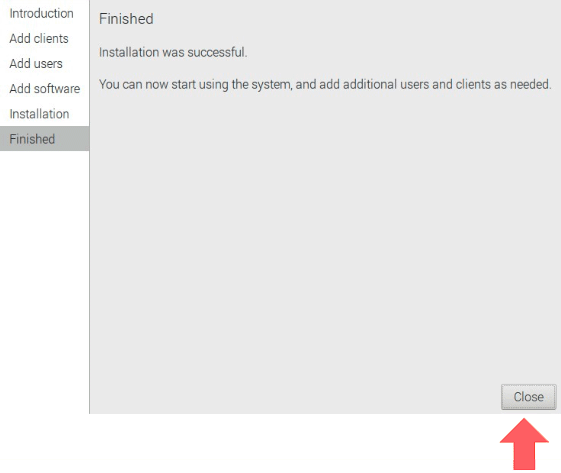

### DCHP Settings

The configuration tool will remain open, go into Settings and set it to act as a standalone DHCP server. Then you can have a set of addresses that are reserved for the Pi clients.

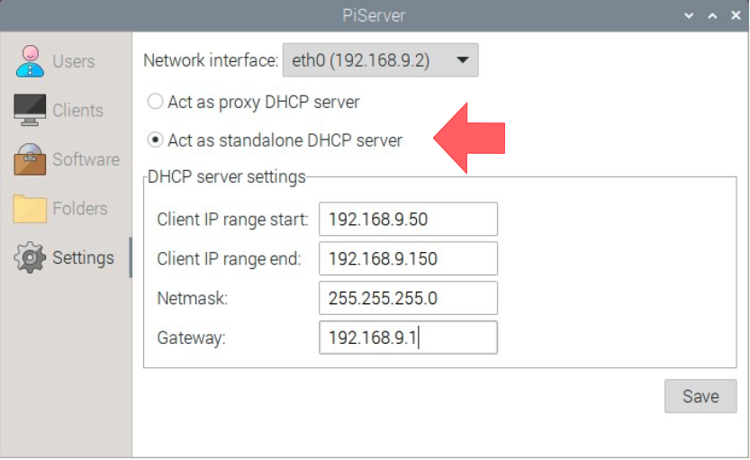

### Add Another OS

You can also go into software and download other available OS images. For example, the Raspberry Pi OS Full (64-bit) has LibreOffice<sup>1</sup> and a lot of other useful applications.

<sup>1</sup>: LibreOffice is a free, open source office suite that is compatible with Microsoft Office file formats for Word, Powerpoint, and Excel.

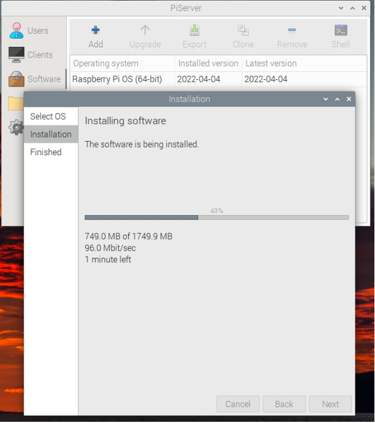

### Assign OS images to Clients

On the “Clients” panel, you can assign different OS images to different Pi clients. The image goes to a specific Pi client, not to a specific user. Users can log into any Pi, so you may have different clients for office applications and different clients for programming, for example.


## Connecting a Client

Now close the PiServer configuration tool and simply reboot. The PiServer starts silently at launch in a mode that’s ready to accept client connections.

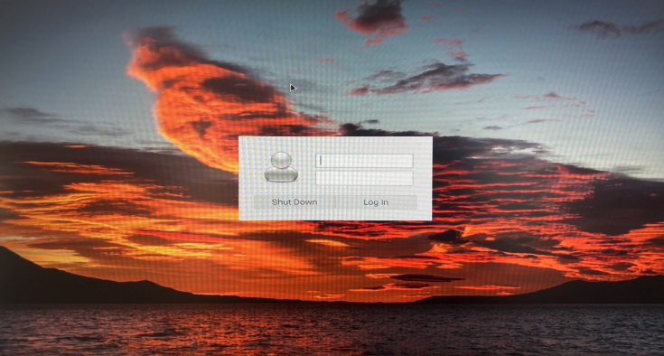

Next let’s power cycle the Raspberry Pi. The screen shows that it’s trying to boot from the network. 20s-30s later, you see two splash screens. In less than a minute and a half you should be at a login window as shown.

Login with user “larry” and password “raspberry” and the system has started and is ready for use.

## Additional Notes

### Customizing OS Images

Customizing is accomplished on PiServer’s “Software” Panel. The best way to do this is to clone an existing OS image. After that, select your “Customized OS Image”, then click “Shell”.

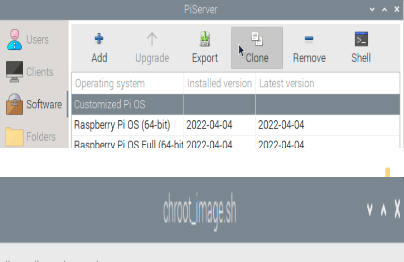

A terminal window will open with root access CHROOTed into the specific build. For those unfamiliar, think of CHROOT as a lighter VM host. You can add and remove software, adjust settings, and they all get delivered to the client machines when they boot. Nice!

### Making Your Own OS Image

This is fairly advanced, but there is a script in var/lib/piserver/scripts called “convert.sh”. This image takes an image of boot and root partition, and combines them into a single file for piserver. The basic process is to create tar files of the boot and root partitions, then turn them into tar.xz, and finally use the convert.sh script to get a working image.

A second option is to start with the raspberry Pi OS Lite image – the smallest image. Make a clone, and then CHROOT and add a basic desktop, and finish customizing from CHROOT. You can add a graphical desktop, or not, and the various customizations that you may need.

## Resources

[Raspberry Pi Desktop](https://www.raspberrypi.com/software/raspberry-pi-desktop/)

[Balena Etcher](https://etcher.balena.io/)

[How to set up a Raspberry Pi](https://www.raspberrypi.com/tutorials/how-to-set-up-raspberry-pi/)

